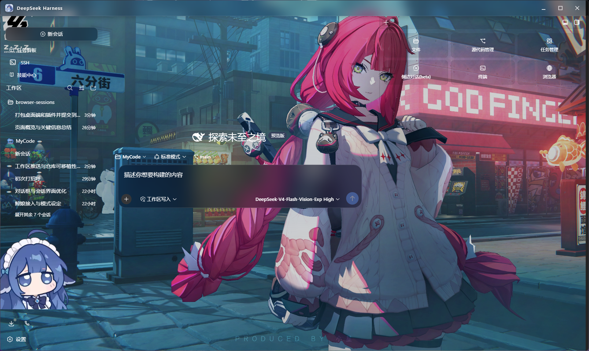

# dsh-setup

我的 DeepSeek Harness 桌面端 + 插件「免痛迁移包」。

克隆到新设备后一键复现完整环境：**dsh 浏览器桥 + Chrome/Firefox 扩展**、以及 **`web` 配置项（全部插件 bundle + 本地鲸鱼挂件 + 浏览器桥插件）**。



仓库结构刻意镜像 `$DSH_HOME`（Windows 默认 `C:\Users\<你>\\.dsh`）的布局，因此相对路径在仓库里和安装后的实际位置都成立：

```
dsh-setup/
├── install.ps1              # Windows 一键安装脚本
├── README.md
├── dsh-browser/             # 对应 $DSH_HOME\dsh-browser
│   ├── packages/browser/bridge-browser/   # @yuxianglin/dsh-bridge-browser 桥插件(源码)
│   ├── extensions/dsh-browser/           # Chrome/Firefox MV3 扩展(源码)
│   ├── scripts/install.sh
│   └── package.json / pnpm-workspace.yaml / ...
└── profiles/
    └── web/                 # 对应 $DSH_HOME\profiles\web
        ├── package.json     # 插件 bundle 清单(相对链接,可移植)
        ├── cordis.yml
        ├── cordis.patch.yml # dsh-doc runtimeDir 改用 !!js 读取 DSH_HOME
        └── local-plugins/
            └── whale-widget/            # 本地鲸鱼挂件(含本地改动,已剔除 .git)
```

> 敏感信息说明：仓库**不含**任何密钥 / token / 凭据。`.credentials.yaml`、`ext-bridge-token`、会话与存储数据都留在本机，未进入仓库。请勿把 `~/.dsh/.credentials.yaml` 之类文件提交进来。

---

## 在新设备上安装

### 0. 准备(一次性)
- Windows + Node.js(≥20) + git
- `pnpm`：`corepack enable && corepack prepare pnpm@11.7.0 --activate`
- npm 全局安装 dsh(若未装)：`npm i -g @deepseek-ai/dsh`

> 中国大陆网络建议配置 GitHub 镜像(与原机一致即可)：
> `git config --global url."https://gh-proxy.com/https://github.com/".insteadOf https://github.com/`

### 1. 克隆
```sh
git clone https://github.com/<owner>/<repo>.git dsh-setup
cd dsh-setup
```

### 2. 一键安装
```sh
powershell -ExecutionPolicy Bypass -File .\install.ps1
```
脚本会：检查前置工具 → 装 dsh(可跳过) → 放置并构建 `dsh-browser` → 放置并安装 `profiles/web` → 把构建好的扩展复制到 `$DSH_HOME\browser-extension`。

常用参数：
- `-SkipDshInstall`：跳过全局安装 dsh
- `-SkipBuild`：跳过 pnpm 构建(不推荐,除非已手动构建过)

### 3. 加载扩展 + 重启 dsh
1. 打开 `chrome://extensions` → 开启「开发者模式」→「加载已解压的扩展程序」→ 选 `$DSH_HOME\browser-extension`(即 `C:\Users\<你>\.dsh\browser-extension`)。
2. 重启 dsh(`dsh web`)。Chrome 回环连接自动发现、无需 token；Firefox 需把 `$DSH_HOME\ext-bridge-token` 里的 token 填进扩展设置。

### 4. 配置凭据与运行时(一次性)
- 在 dsh 凭据界面配置 `DEEPSEEK_API_KEY`(鲸鱼挂件余额必需)；可选 `DEEPSEEK_PLATFORM_TOKEN` 用于「实时·令牌」用量模式。
- dsh-doc 的 `runtimeDir` 已用 `!!js process.env.DSH_HOME + '\runtimes\dshdoc-runtime-win32-x64'` 动态解析；请确保 dsh 已下载对应平台的 dshdoc 运行时。

---

## 手动分步(不跑脚本时)
```sh
# dsh-browser
cd dsh-browser && pnpm install && pnpm build        # 生成 bridge lib/ 与 extension dist/
# 扩展目录即 extensions/dsh-browser/dist

# web profile(先保证 dsh-browser 已构建,因 bridge 使用 link: 指向其 lib/)
cd profiles/web && pnpm install
```

## 说明
- 插件版本清单见 `profiles/web/package.json` 的 `dependencies` 与 `dsh.profile.bundles`,换设备时按需升级。
- 本包为私有仓库,默认只包含源码与配置,不含构建产物、不含任何本地节点模块。

## 上游来源与许可(第三方)
本仓库**复制(vendor)**了以下第三方项目源码,各自遵循其原始许可证;本仓库仅作个人环境迁移用途:
- `dsh-browser/` — 来自 [Lum1104/dsh-browser](https://github.com/Lum1104/dsh-browser)(MIT,作者 Yuxiang Lin)。
- `profiles/web/local-plugins/whale-widget/` — 来自 [MeteorNOX/DeepSeek-Balance-Whale-Widget](https://github.com/MeteorNOX/DeepSeek-Balance-Whale-Widget)(含本地改动)。

如需升级/更新这些上游组件,请从对应上游仓库拉取最新版本;本仓库不会自动同步。
