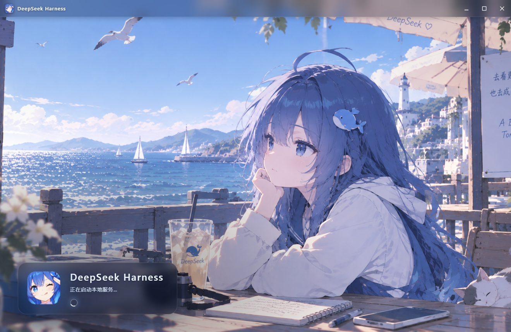
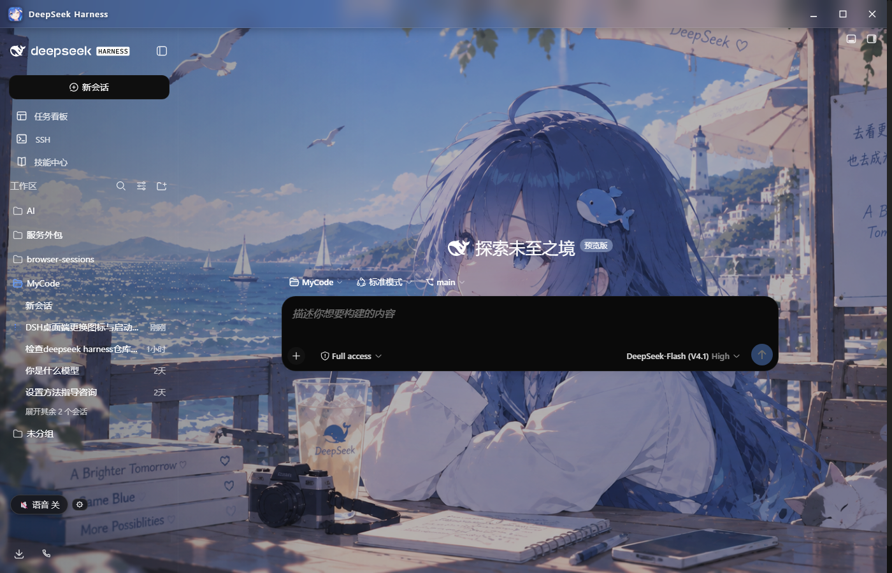
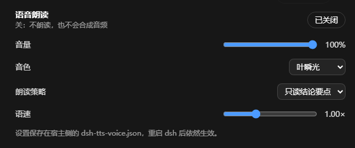

<div align="center">


# DeepSeek Harness 桌面端 · 语音增强

**把 DeepSeek Harness 装进一个像样的原生窗口：随机壁纸、记住窗口状态、可开关的本地语音朗读。**
外加一套 `$DSH_HOME` 免痛迁移包（浏览器桥 + 扩展 + 完整 `web` 配置档）。

[](#环境要求)
[](desktop/package.json)
[](#环境要求)
[](#上游来源与许可第三方)



<sub>启动界面：每次启动从 `assets/backgrounds/` 随机挑一张 —— 上面是「海边」，下面是「夜晚」</sub>


</div>

---

## 仓库里有什么

| 目录 | 是什么 | 文档 |
|---|---|---|
| [`desktop/`](desktop/) | **桌面端外壳**（Electron）：自动拉起/复用 `dsh web`，无边框 + 注入式标题栏 + 随机壁纸 + 窗口状态记忆 | [desktop/README.md](desktop/README.md) |
| [`tts-voice/`](tts-voice/) | **本地语音朗读插件**：GPT-SoVITS 逐句朗读，设置里有原生配置页，默认只读「结论要点」 | [tts-voice/README.md](tts-voice/README.md) |
| [`dsh-browser/`](dsh-browser/) | 浏览器桥 + Chrome/Firefox MV3 扩展（源码） | 见下 |
| [`profiles/`](profiles/) | `web` 配置档：全部插件 bundle + 本地鲸鱼挂件 + 桥插件 | 见下 |
| [`install.ps1`](install.ps1) | Windows 一键安装（把仓库结构镜像到 `$DSH_HOME`） | 见下 |

---

## 一、桌面端

<div align="center">

</div>

- **双击即用**：`desktop\start.bat` 先探测 `127.0.0.1:3080` —— 已在跑就直接复用，没跑就自己拉起来；关窗时把后端子进程树一起收干净。
- **随机壁纸**：6 张壁纸每次启动随机挑一张，**启动界面与主界面用同一次随机结果**。换壁纸只需往 `desktop/assets/backgrounds/` 增删图片，不用改代码。
- **窗口状态会被记住**：尺寸、位置、是否最大化存在 `%APPDATA%\dsh-desktop\window-state.json`，下次原样恢复。最大化时记的是**还原尺寸**，所以「最大化 → 关闭 → 再开」不会把窗口永久顶满屏；拔掉外接屏后会自动只丢位置、保留尺寸，避免窗口跑到看不见的地方。
- **无边框 + 注入式标题栏**：标题栏由 preload 注入并做毛玻璃，让真实壁纸透上来；窗口控制、品牌标、壁纸层同源。
- **一套美术资源两处复用**：`assets/icon-src.png` 既生成 `icon.ico`（多尺寸，任务栏/资源管理器），也生成 `splash.png`（标题栏 24px 品牌标 + 启动界面 Logo）：

  ```powershell
  powershell -ExecutionPolicy Bypass -File .\desktop\make-icon.ps1
  ```

## 二、语音朗读插件

<div align="center">

</div>

- **它是真插件，不是脚本注入**：声明 `dsh.client` + `exports["./client"]`，客户端 bundle 由 dsh 的 boot 图加载，因此在**设置里长出原生一页**（总开关 / 音量 / 音色 / 朗读策略 / 句数上限 / 语速）。- **开关状态不再分叉**：设置的真源是宿主侧文件 `dsh-tts-voice.json`（原子写）。以前开关同时存在浏览器 localStorage 与服务端内存两处、服务端一重启就重置；现在前端每次轮询都对齐宿主真源，**重启 dsh 后开关状态照旧**。
- **像日常沟通，而不是朗读版屏幕阅读器**：默认只读「结论要点」，过程话（「让我先看一下…」/「I'll check…」）跳过；Markdown 记号、表格、URL、盘符路径、「文件:行号」、代码块、emoji 全部清洗；**工具调用与中间状态在事件层就被过滤，结构上不会被念出来**。
- **不白占资源**：语音关着时启动**不预热模型**，在设置里关掉会立刻停掉自己拉起的 TTS 进程；未被消费的音频达到 12 段 / 24MB 就暂停合成，超时自动丢弃。
- 左下角悬浮按钮：**单击即开/关**，旁边 ⚙ 单击展开说明（不再是 hover 才能用）。

## 三、环境要求

- **Windows 10/11**（桌面端的图标/快捷方式与进程收尾是 Windows 实现）
- **Node.js 20+**（`node -v` 可查）
- **`@deepseek-ai/dsh`**：`npm install -g @deepseek-ai/dsh`
- 语音插件另需本地 **GPT-SoVITS V2** 部署（默认 `F:/AI/GPT-SoVITS`，可用 `DSH_TTS_DIR` 覆盖）

## 四、快速开始

```powershell
# 桌面端
cd desktop
.\start.bat                     # 首次会自动装 Electron 运行时（约 150MB）

# 语音插件（可选）
dsh plugin --profile web add link:<仓库路径>\tts-voice
```

Electron 运行时下载慢或失败时，`start.bat` 会自动改用 npmmirror；也可手动强制：

```bat
set ELECTRON_MIRROR=https://npmmirror.com/mirrors/electron/
node node_modules\electron\install.js
```

## 五、自测

```powershell
# 窗口状态记忆（17 项断言，独立 userData 目录，不动你的真实记忆文件）
node_modules\electron\dist\electron.exe --user-data-dir=%TEMP%\x desktop\test-window-state.js

# 语音插件：朗读策略 + 宿主集成 + 客户端行为（共 138 项断言，不需要 dsh 运行）
node tts-voice\test\read-policy.test.mjs
node tts-voice\test\host-integration.test.mjs
node tts-voice\test\client-behavior.test.mjs
node tts-voice\test\client-dom.test.mjs
```

---

# 附：`$DSH_HOME` 免痛迁移包

克隆到新设备后一键复现完整环境：**dsh 浏览器桥 + Chrome/Firefox 扩展**，以及 **`web` 配置项（全部插件 bundle + 本地鲸鱼挂件 + 浏览器桥插件）**。


仓库结构刻意镜像 `$DSH_HOME`（Windows 默认 `C:\Users\<你>\.dsh`）的布局，因此相对路径在仓库里和安装后的实际位置都成立：

```
dsh-setup/
├── install.ps1              # Windows 一键安装脚本
├── desktop/                 # 桌面端外壳(独立项目,见上文)
├── tts-voice/               # 语音朗读插件(独立项目,见上文)
├── README.md
├── dsh-browser/             # 对应 $DSH_HOME\dsh-browser
│   ├── packages/browser/bridge-browser/   # @yuxianglin/dsh-bridge-browser 桥插件(源码)
│   ├── extensions/dsh-browser/           # Chrome/Firefox MV3 扩展(源码)
│   ├── scripts/install.sh
│   └── package.json / pnpm-workspace.yaml / ...
└── profiles/
    └── web/                 # 对应 $DSH_HOME\profiles\web
        ├── package.json     # 插件 bundle 清单(相对链接,可移植)
        ├── cordis.yml
        ├── cordis.patch.yml # dsh-doc runtimeDir 改用 !!js 读取 DSH_HOME
        └── local-plugins/
            └── whale-widget/            # 本地鲸鱼挂件(含本地改动,已剔除 .git)
```

> 敏感信息说明：仓库**不含**任何密钥 / token / 凭据。`.credentials.yaml`、`ext-bridge-token`、会话与存储数据都留在本机，未进入仓库。请勿把 `~/.dsh/.credentials.yaml` 之类文件提交进来。

## 在新设备上安装

### 0. 准备(一次性)
- Windows + Node.js(≥20) + git
- `pnpm`：`corepack enable && corepack prepare pnpm@11.7.0 --activate`
- npm 全局安装 dsh(若未装)：`npm i -g @deepseek-ai/dsh`

> 中国大陆网络建议配置 GitHub 镜像(与原机一致即可)：
> `git config --global url."https://gh-proxy.com/https://github.com/".insteadOf https://github.com/`

### 1. 克隆
```sh
git clone https://github.com/<owner>/<repo>.git dsh-setup
cd dsh-setup
```

### 2. 一键安装
```sh
powershell -ExecutionPolicy Bypass -File .\install.ps1
```
脚本会：检查前置工具 → 装 dsh(可跳过) → 放置并构建 `dsh-browser` → 放置并安装 `profiles/web` → 把构建好的扩展复制到 `$DSH_HOME\browser-extension`。

常用参数：
- `-SkipDshInstall`：跳过全局安装 dsh
- `-SkipBuild`：跳过 pnpm 构建(不推荐,除非已手动构建过)

### 3. 加载扩展 + 重启 dsh
1. 打开 `chrome://extensions` → 开启「开发者模式」→「加载已解压的扩展程序」→ 选 `$DSH_HOME\browser-extension`(即 `C:\Users\<你>\.dsh\browser-extension`)。
2. 重启 dsh(`dsh web`)。Chrome 回环连接自动发现、无需 token；Firefox 需把 `$DSH_HOME\ext-bridge-token` 里的 token 填进扩展设置。

### 4. 配置凭据与运行时(一次性)
- 在 dsh 凭据界面配置 `DEEPSEEK_API_KEY`(鲸鱼挂件余额必需)；可选 `DEEPSEEK_PLATFORM_TOKEN` 用于「实时·令牌」用量模式。
- dsh-doc 的 `runtimeDir` 已用 `!!js process.env.DSH_HOME + '\runtimes\dshdoc-runtime-win32-x64'` 动态解析；请确保 dsh 已下载对应平台的 dshdoc 运行时。

---

## 手动分步(不跑脚本时)
```sh
# dsh-browser
cd dsh-browser && pnpm install && pnpm build        # 生成 bridge lib/ 与 extension dist/
# 扩展目录即 extensions/dsh-browser/dist

# web profile(先保证 dsh-browser 已构建,因 bridge 使用 link: 指向其 lib/)
cd profiles/web && pnpm install
```

## 说明
- 插件版本清单见 `profiles/web/package.json` 的 `dependencies` 与 `dsh.profile.bundles`,换设备时按需升级。
- 本包为私有仓库,默认只包含源码与配置,不含构建产物、不含任何本地节点模块。
- `desktop/` 与 `tts-voice/` 是两个独立项目:前者用 `npm`,后者是 `dsh plugin add link:` 装的本地插件,与上面的迁移包互不依赖。

## 上游来源与许可(第三方)
本仓库**复制(vendor)**了以下第三方项目源码,各自遵循其原始许可证;本仓库仅作个人环境迁移用途:
- `dsh-browser/` — 来自 [Lum1104/dsh-browser](https://github.com/Lum1104/dsh-browser)(MIT,作者 Yuxiang Lin)。
- `profiles/web/local-plugins/whale-widget/` — 来自 [MeteorNOX/DeepSeek-Balance-Whale-Widget](https://github.com/MeteorNOX/DeepSeek-Balance-Whale-Widget)(含本地改动)。

如需升级/更新这些上游组件,请从对应上游仓库拉取最新版本;本仓库不会自动同步。

`desktop/` 与 `tts-voice/` 为本人自写代码,MIT 授权。桌面端的美术资源(图标与壁纸)仅随本仓库用于个人使用,请勿单独再分发。
